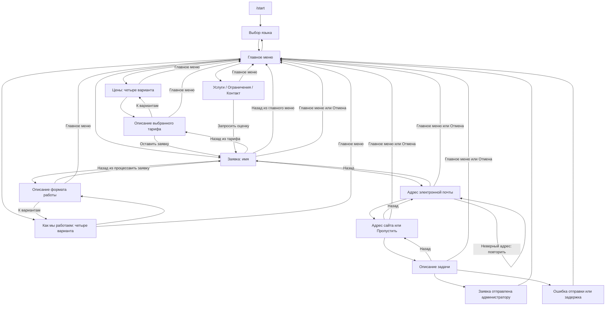

# Сценарий Telegram-бота

Диаграмма написана на [Mermaid](https://mermaid.js.org/): это редактируемый текст. GitHub показывает блок ниже как схему. Подписи кнопок и тексты ответов хранятся отдельно в `knowledge/en/` и `knowledge/ru/`.

## Варианты в разделах

| Ключ | Цены | Как мы работаем |
| --- | --- | --- |
| `one_time` | Разовая задача, от $75 | Оценка → согласование → выполнение → проверка |
| `content` | Поддержка контента, $149/мес. | Ежемесячный план → обновление материалов → проверка |
| `technical` | Полный WordPress Care, $229/мес. | Согласование обслуживания → обновления, копии и мониторинг |
| `custom` | Расскажите, что вам нужно | Уточнение задачи → индивидуальное предложение |

Каждый вариант сначала показывает краткое описание, затем предлагает оставить заявку. В заявку передаётся выбранный вариант.

## Где редактировать

| Что менять | Файлы |
| --- | --- |
| Общие подписи, вопросы заявки и сообщения об ошибках | `knowledge/<язык>/messages.json` |
| Описания тарифов и цены | `knowledge/<язык>/pricing.json` |
| Описания форматов работы | `knowledge/<язык>/process.json` |
| Краткие ответы для остальных пунктов меню | `knowledge/<язык>/topics.json` |

Ключи вариантов `one_time`, `content`, `technical` и `custom` одинаковы в обоих языках и двух разделах. Кнопка «Главное меню» завершает незавершённую заявку; кнопка «Назад» возвращает на предыдущий шаг или к выбранному варианту.
