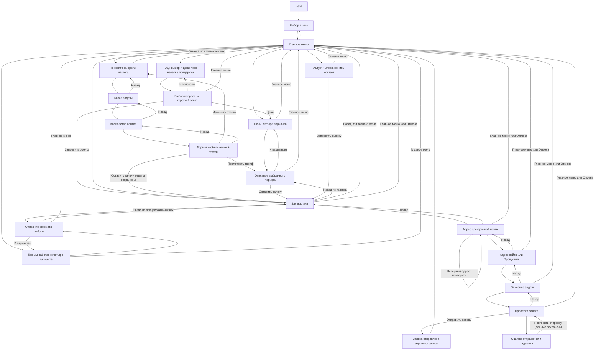

# Сценарий Telegram-бота

Диаграмма написана на [Mermaid](https://mermaid.js.org/): это редактируемый текст. GitHub показывает блок ниже как схему. Подписи кнопок и тексты ответов хранятся отдельно в `knowledge/en/` и `knowledge/ru/`.

```mermaid
flowchart TD
    Start["/start"] --> Language["Выбор языка"]
    Language --> Menu["Главное меню"]

    Menu --> Pricing["Цены: четыре варианта"]
    Menu --> Process["Как мы работаем: четыре варианта"]
    Menu --> Topic["Услуги / Ограничения / Контакт"]
    Menu --> FAQ["FAQ: выбор и цены / как начать / поддержка"]
    FAQ --> Question["Выбор вопроса → короткий ответ"]
    Question -->|К вопросам| FAQ
    Question -->|Цены| Pricing
    Question -->|Запросить оценку| Name
    Question -->|Главное меню| Menu
    Menu --> Name["Заявка: имя"]
    Menu --> PickMode["Помогите выбрать: частота"]
    PickMode --> PickNeed["Какие задачи"]
    PickNeed --> PickSites["Количество сайтов"]
    PickSites --> Suggest["Формат + объяснение + ответы"]
    Suggest -->|Оставить заявку, ответы сохранены| Name
    Suggest -->|Изменить ответы| PickMode
    Suggest -->|Назад| PickSites
    PickSites -->|Назад| PickNeed
    PickNeed -->|Назад| PickMode
    Suggest -->|Посмотреть тариф| PriceDetail
    PickMode -->|Отмена или главное меню| Menu
    Menu --> Language

    Pricing --> PriceDetail["Описание выбранного тарифа"]
    PriceDetail -->|К вариантам| Pricing
    PriceDetail -->|Оставить заявку| Name

    Process --> ProcessDetail["Описание формата работы"]
    ProcessDetail -->|К вариантам| Process
    ProcessDetail -->|Оставить заявку| Name

    Topic -->|Главное меню| Menu
    Topic -->|Запросить оценку| Name

    Name --> Email["Адрес электронной почты"]
    Email -->|Неверный адрес: повторить| Email
    Email --> Website["Адрес сайта или Пропустить"]
    Website --> Details["Описание задачи"]
    Details --> Review["Проверка заявки"]
    Review -->|Отправить заявку| Sent["Заявка отправлена администратору"]
    Review --> Error["Ошибка отправки или задержка"]
    Review -->|Назад| Details
    Sent --> Menu
    Error -->|Повторить отправку, данные сохранены| Review

    Email -->|Назад| Name
    Website -->|Назад| Email
    Details -->|Назад| Website
    Name -->|Назад из тарифа| PriceDetail
    Name -->|Назад из процесса| ProcessDetail
    Name -->|Назад из главного меню| Menu

    Pricing -->|Главное меню| Menu
    Process -->|Главное меню| Menu
    PriceDetail -->|Главное меню| Menu
    ProcessDetail -->|Главное меню| Menu
    Name -->|Главное меню или Отмена| Menu
    Email -->|Главное меню или Отмена| Menu
    Website -->|Главное меню или Отмена| Menu
    Details -->|Главное меню или Отмена| Menu
    Review -->|Главное меню или Отмена| Menu
```

## Варианты в разделах

| Ключ | Цены | Как мы работаем |
| --- | --- | --- |
| `one_time` | Разовая задача, от $75 | Оценка → согласование → выполнение → проверка |
| `content` | Поддержка контента, $149/мес. | Ежемесячный план → обновление материалов → проверка |
| `technical` | Полный WordPress Care, $229/мес. | Согласование обслуживания → обновления, копии и мониторинг |
| `custom` | Расскажите, что вам нужно | Уточнение задачи → индивидуальное предложение |

Каждый вариант сначала показывает краткое описание, затем предлагает оставить заявку. В заявку передаётся выбранный вариант.

## Где редактировать

| Что менять | Файлы |
| --- | --- |
| Общие подписи, вопросы заявки и сообщения об ошибках | `knowledge/<язык>/messages.json` |
| Описания тарифов и цены | `knowledge/<язык>/pricing.json` |
| Описания форматов работы | `knowledge/<язык>/process.json` |
| Краткие ответы для остальных пунктов меню | `knowledge/<язык>/topics.json` |
| FAQ: группы, вопросы, ответы, источники и формулировки | `knowledge/<язык>/faq.json` |
| Вопросы подбора, варианты, объяснения и оговорка | `knowledge/<язык>/selection.json` |

Ключи вариантов `one_time`, `content`, `technical` и `custom` одинаковы в обоих языках и двух разделах. Кнопка «Главное меню» завершает незавершённую заявку; кнопка «Назад» возвращает на предыдущий шаг или к выбранному варианту.

При повторном `/start` выбранный язык сохраняется. Заявки принимаются только в личном чате. Перед отправкой пользователь видит все ответы и подтверждает передачу специалисту. Сайт можно пропустить кнопкой. Ошибки ввода не меняют шаг; слишком длинные ответы не обрезаются.

## FAQ и свободный текст

12 вопросов сгруппированы по потребности посетителя: выбор и цены, начало работы,
поддержка и ограничения. В ответе есть возврат к вопросам, переход к ценам и заявке.
Отдельный вопрос не требует предварительно оставлять контакты.

Вне заявки бот распознаёт заголовки и заранее подготовленные формулировки вопросов
на обоих языках; ответ показывает на выбранном языке. Игнорирует регистр,
пунктуацию и повторные пробелы. Сопоставление точное: неизвестные, неоднозначные
или длинные вопросы получают подсказку с меню. Произвольный разговор не поддержан.
Во время заполнения заявки текст остаётся ответом на текущий вопрос формы.

Ответы привязаны к публичным Services/Pricing; индивидуальные условия, способы
оплаты и сроки ответа специалиста не выдумываются. В JSON есть дата сверки и URL
источника у каждого ответа. Изменение условий на сайте требует проверки обоих
языков и связанных ответов в pricing/topics.

## Помогите выбрать

Три вопроса: частота помощи, основной тип задачи, количество сайтов. Контакты
пока не запрашиваются. Предварительная рекомендация определяется простыми правилами:

| Ответы | Рекомендация |
| --- | --- |
| Один действующий сайт, одна задача с контентом или небольшая техническая задача | Разовая задача, от $75 |
| Один действующий сайт, регулярные изменения контента | Content Support, $149/мес. |
| Один действующий сайт, регулярный технический уход | Complete WordPress Care, $229/мес. |
| Несколько сайтов, запуск, сложная задача или любой неопределённый ответ | Индивидуальная оценка |

Результат показывает объяснение и все ответы, позволяет начать заявку, посмотреть
тариф, исправить ответы или выйти. Назад удаляет ответ предыдущего шага и все
зависимые ответы; старые кнопки не позволяют перескочить через вопросы. Текстовый
ответ вместо кнопки повторно показывает текущий вопрос.

При прямом переходе «Оставить заявку» формат и ответы включаются в форму, сводку
перед подтверждением и сообщение специалисту. Назад с первого шага заявки
возвращает к рекомендации. После просмотра тарифа можно оставить обычную заявку
по этому тарифу; ответы подбора в этом случае не сохраняются. Язык, отмена и
главное меню завершают подбор. Подбор не оформляет заказ и не гарантирует цену.
